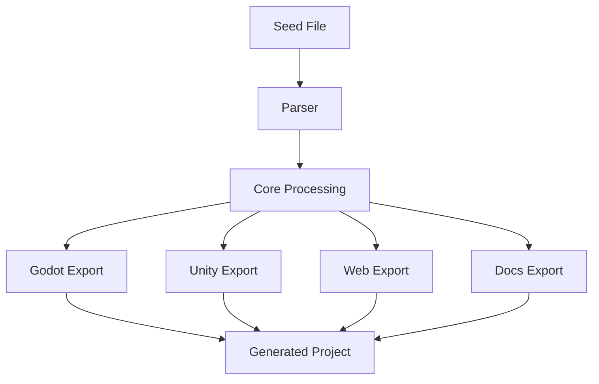

# Equorn Architecture

This document provides an overview of Equorn's architecture and explains how the different components interact.

## System Overview

Equorn transforms structured narrative blueprints (seeds) into various output formats through a pipeline of parsing, processing, and generation. The system is organized as a monorepo with specialized packages for different concerns.



## Key Components

### Core Package

The core package contains the fundamental functionality:

- **Parser**: Converts seed files (YAML/JSON) into typed TypeScript objects
- **Types**: Defines the structure of entities, environments, quests, and exports
- **Generators**: Transforms parsed seeds into output for different targets
- **Builders**: Specialized modules for constructing specific mythological elements

### CLI Package

The CLI provides command-line access to Equorn's functionality:

- **Commands**: Implements commands like `init`, `seed`, and `generate`
- **Config**: Manages user configuration and preferences
- **Utils**: Helper functions for CLI operation

### Web Package

The web dashboard visualizes and allows interaction with generated content:

- **UI Components**: React components for visualization
- **API**: Backend endpoints for processing requests
- **State Management**: Manages application state

### Templates Package

Contains template files used by generators for different targets:

- **Godot**: Templates for Godot game engine projects
- **Unity**: Templates for Unity game engine projects
- **Web**: Templates for web-based projects
- **Docs**: Templates for documentation generation

## Data Flow

1. **Input**: User provides a seed file with entity, environment, and quest definitions
2. **Parsing**: The parser converts the seed into a strongly-typed object structure
3. **Processing**: The core applies business logic to prepare the seed for generation
4. **Generation**: Target-specific generators create output files
5. **Output**: Generated project files are written to the specified output directory

## Key Interfaces

### SeedConfig

The central data structure representing a parsed seed file:

```typescript
export interface SeedConfig {
  entity?: EntityConfig;
  environment?: EnvironmentConfig;
  quests?: QuestConfig[];
  export?: ExportConfig;
}
```

### GenerationOptions

Controls how generation happens:

```typescript
export interface GenerationOptions {
  target: 'godot' | 'unity' | 'web' | 'docs';
  verbose?: boolean;
  output?: string;
}
```

## Development Patterns

- **Type Safety**: We use TypeScript throughout for robust type checking
- **Functional Style**: Pure functions are preferred where possible
- **Modular Design**: Components are designed for reuse and composability

## Future Architecture Considerations

- **Plugin System**: Allow third-party generators and parsers
- **Web API**: Provide remote generation capabilities
- **Cache Layer**: Optimize repeated generations with caching
